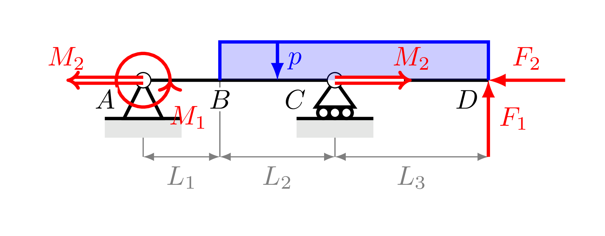
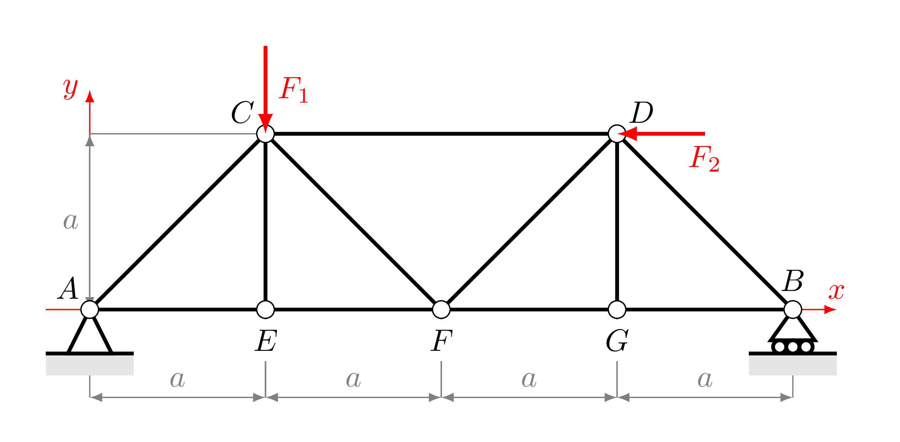
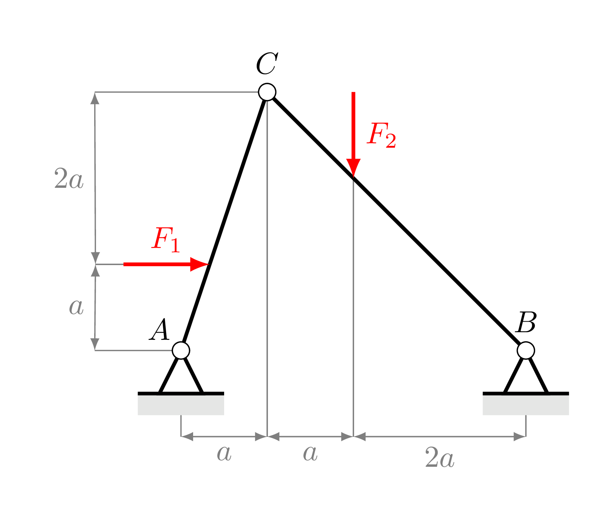
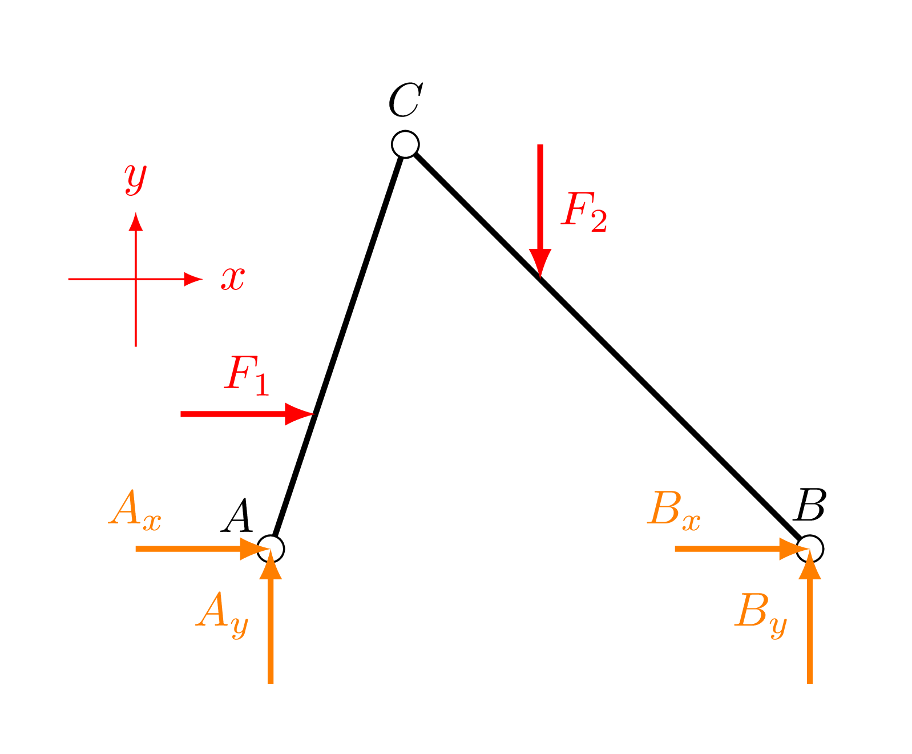
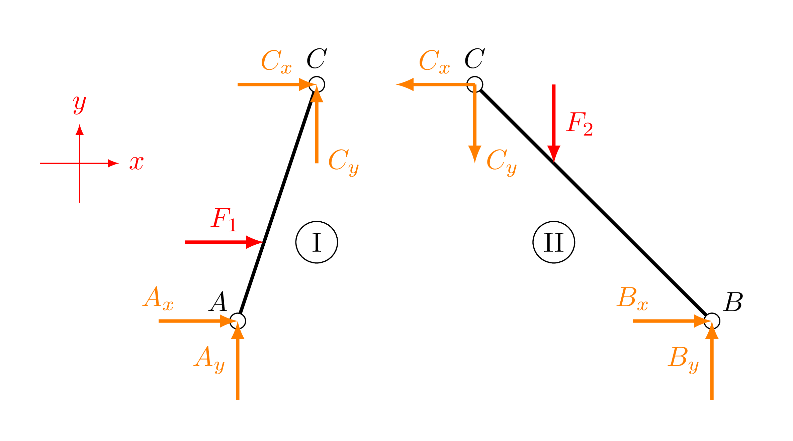

# MechTikz

A **mechTikz** egy kiegészítő LaTeX/TikZ makrógyűjtemény, amely megkönnyíti rúd- és gerandamodellek rajzolását TikZ-ben. _A cél az, hogy szép és egységes mechanikai ábrákat tudj készíteni LaTeX-ben a TikZ könyvtár segítségével._

---

## Miért a TikZ?

A **TikZ** a LaTeX egyik legnépszerűbb grafikus csomagja, amely lehetővé teszi, hogy **vektoros ábrákat** készítsünk közvetlenül a LaTeX dokumentumon belül — külső programok vagy képszerkesztők nélkül.

A $\LaTeX{}$ rendszerhez hasonlóan a TikZ is **nyílt forráskódú** és **platformfüggetlen** és ideális műszaki ábrák elkészítéséhez, habár nem a legegyszerűbb megoldás!

A TikZ fő előnyei:

- **Pontosság és skálázhatóság** – minden elem matematikailag definiált, így az ábrák bármilyen méretben torzításmentesen nagyíthatók.  
- **Integráció a LaTeX-szel** – az ábrákban ugyanúgy használhatók képletek, változók és stílusok, mint a szövegben.  
- **Reprodukálhatóság** – az ábrák forráskódból generálódnak, így verziókezelhetőek és könnyen módosíthatók.  
- **Professzionális megjelenés** – a rajzok egységes stílusban illeszkednek a dokumentum tipográfiájához.  
- **Automatizálhatóság** – egyszer definiált makrókkal (mint a `mechTikz`) komplex szerkezetek is gyorsan és hibamentesen megrajzolhatók.  

---

## MechTikz használata

### TikZ importálása

A TikZ használatához először **be kell tölteni a megfelelő csomagot** a LaTeX dokumentumod preambulumában, azaz a `\begin{document}` előtti részben.

A szükséges csomagok és könyvtárak a következők:

```latex
\usepackage{tikz}
\usetikzlibrary{math} % matematikai számítások Tikz-ben
\usetikzlibrary{calc} % geometriai számítások (pl. koordináták)
\usetikzlibrary{angles} % szögjelölések rajzolása
\usetikzlibrary{quotes} % címkék és feliratok egyszerű kezelése
\usetikzlibrary{arrows.meta} % nyílstílusok
\usetikzlibrary{decorations.markings} % díszítések
```

### MechTikz importálása

A `mechTikz.tex` fájl tartalmazza az előre definiált Tikz makrókat. A makrók használatához be kell töltenünk a fájl tartalmát a LaTeX dokumentumod preambulumában, azaz a `\begin{document}` előtti részben.

```latex
\input{mechTikz.tex}
```

**Fontos**, hogy a `mechTikz.tex` fájl a `main.tex` fájllal egy mappában kell lennie. Ha a `mechTikz.tex` a `main.tex` könyvtárában, de egy külön mappában található, akkor a következőképpen kell meghívni: `\input{MAPPA_NEVE/mechTikz.tex}`

### MechTikz stílusok

A `mechtikz.tex` fájlban számos **TikZ stílus** előre definiálva van, amelyek megkönnyítik a mechanikai ábrák rajzolását. A stílusok előre beállított színeket, vonalvastagságot, nyílformákat és dekorációkat tartalmaznak, így az ábrák egységes, letisztult megjelenésűek lesznek.

| Stílus | Leírás |
|--------|---------|
| `point` | **Fekete kitöltött kör**, amelyet csomópontok (pl. A, B, C pont) jelölésére használunk|
| `link` | **Vastag rúd vagy összekötő vonal** két pont között|
| `angle` | **Kétirányú nyíl**, amely szögeket vagy irányokat jelöl|
| `vec` | **Vastag, egyirányú nyíl**, általános vektorábrázoláshoz|
| `arc vec` | **Köríves nyíl**  **forgásirány** vagy **nyomaték** jelölésére  |
| `arc vec2` | **Köríves nyíl ellentétes irányban**, az `arc vec` tükörképe |
| `force` | **Erővektor stílus** |
| `moment` | **Nyomaték stílus** |
| `coordSys` | **Koordinátatengely stílus** |
| `guide` | **Vékony szürke segédvonal**, szerkesztésekhez, távolságjelöléshez, méretvonalakhoz|
| `guideVec` | **Kétirányú segédnyíl**, távolságjelöléshez két pont között  |
| `construct` | **Szaggatott vastag vonal**,  **szerkesztési vonalak** megjelenítésére |

#### 💡 Tipp

A legtöbb **mechTikz stílus** paraméterezhető színnel a `#1` argumentumon keresztül. Ez azt jelenti, hogy a stílus meghívásakor megadhatod, milyen színben szeretnéd az adott elemet kirajzolni.

Példa:

```latex
% Példa a 'vec' stílus használatára (piros erővektor)
\begin{tikzpicture}
  \draw[vec={red}] (0,0) -- (2,1) node[right] {$\vec{F}$}; % piros vektor, erő jelölés
\end{tikzpicture}
```
A `vec={red}` részben a `red` tetszőlegesen lecserélhető bármilyen színre (pl. `blue`, `green!70!black`, `gray` stb.).

### MechTikz makrók

A `mechtikz.tex` fájlban a stílusok mellett, számos **TikZ makró** is előre definiálva van, amelyek megkönnyítik a mechanikai ábrák rajzolását. A makrók többek között alátámasztások, csuklók, távolságjelölések vagy a kordinátarendszer kirajzolását segítik.  

| Parancs | Leírás | Példa |
|----------|---------|----------------|
| `\dimarrow` | **Távolságjelölés**  | `\dimarrow{pont1}{pont2}{eltolás1}{eltolás2}{felirat}{felirat pozíció}` |
| `\coordSys` | **Koordinátarendszer** | `\coordSys{x,y}` |
| `\supporthinge` | **Csuklós alátámasztás**| `\supporthinge{pozíció}{forgatási szög}` |
| `\supportroller` | **Görgős alátámasztás** | `\supportroller{pozíció}{forgatási szög}` |
| `\supportfixed` | **Befogás** | `\supportfixed{pozíció}{forgatási szög}` |
| `\supportslider` | **Csúszka** | `\supportslider{pozíció}{forgatási szög}{sín távolság}` |
| `\supportrope` | **Kötél, felfüggesztés** | `\supportrope{pozíció}{forgatási szög}{hossz}` |
| `\supportsimple` | **Egyszerű támasz** | `\supportsimple{pozíció}{forgatási szög}` |
| `\hinge` | **Csukló** | `\hinge{pozíció}` |

---

## TikZ ábrák készítése

### TikZ ábra létrehozása és beillesztése

A TikZ ábrákat célszerű külön fájlban elhelyezni, hogy a fő LaTeX dokumentum áttekinthető és jól strukturált maradjon. Ezek az ábrákat tartalmazó fájlok ugyanúgy `.tex` kiterjesztésűek, és jellemzően egy önálló `tikzpicture` környezetet foglalnak magukban, amelyben az adott rajz teljes kódja megtalálható.

Példa:

```latex
% Egy abra.tex fájl általános struktúrája
\begin{tikzpicture}
  ...
\end{tikzpicture}
```

A külön `.tex` fájlban lévő TikZ ábrát a fő dokumentumba a `\input` paranccsal tudod beilleszteni,
legtöbbször a `figure` környezeten belül.

```latex
% Az abra.tex fájl beillesztése a fő dokumentumba
\begin{figure}[htpb]
  \centering
  \input{abra.tex} % TikZ ábra beillesztése
  \caption{Valamilyen képaláírás...} 
  \label{fig:abra}
\end{figure}
```

### TikZ ábra felépítése

A TikZ ábrák **pontokra, vonalakra és alakzatokra** épülnek, melyek **matematikailag pontosan definiált koordináták** és **grafikai parancsok** segítségével jönnek létre.  

A TikZ ábrákat érdemes **logikai sorrendben, rétegesen** felépíteni az alábbi lépések mentén:

1. **Csomópontok definiálása** – minden olyan pont megadása, amelyet az ábra későbbi részei hivatkozni fognak
2. **Kapcsolatok meghatározása** – a pontokat összekötő rudak, elemek, szerkezeti vonalak rajzolása
3. **Kiegészítő elemek hozzáadása** – alátámasztások, csuklók, koordinátarendszerek
4. **Vektorok megrajzolása** – erők, nyomatékok, megoszló terhelések
5. **Segédvonalak beillesztése** – szerkesztési vonalak, méretvonalak.  
6. **Feliratok, jelölések elhelyezése** – csomópontnevek, méretek, erők, szöveges kiegészítések.

A rajzolás **rétegesen** zajlik: a kódban **később megadott elemek** mindig **a korábban rajzolt elemek fölé kerülnek** az ábrán. 


### TikZ parancsok (alapok)

A TikZ parancsai határozzák meg, **mit** és **hogyan** szeretnél megrajzolni az ábrán.  

---

#### `\coordinate` – pontok definiálása

A `\coordinate` parancs segítségével nevesített pontokat (csomópontokat) hozhatsz létre, amelyeket később hivatkozhatsz.

**Alapszintaxis:**
```latex
\coordinate (Név) at (x,y);
```

```latex
\coordinate (A) at (0,0);
\coordinate (B) at (4,0);
\coordinate (C) at (2,2);
```

---

#### `\draw` – vonalak, alakzatok és stílusok rajzolása

A `\draw` parancs a TikZ egyik alapvető utasítása: **vonalakat, nyilakat, íveket és alakzatokat** rajzol.  

**Alapszintaxis:**
```latex
\draw[stílus] (kezdőpont) -- (végpont);
```

```latex
\draw[link={black}] (A) -- (B);                % rúd vagy kapcsolat
\draw[coordSys={red}] (A) -- (B);              % tengely
\draw[force={blue}] (A) -- +(0,-1);            % erővektor
\draw[moment={red}] (A) -- +(0,-1);            % nyomatékvektor
\draw[arc vec={red}] (A) circle[radius=0.35];  % köríves nyomatékvektor
\draw[construct={gray}] (A) -- (B);            % szerkesztési vonal
\draw[guide={gray}] (A) -- (B);                % segédvonal
```

---

#### `\node` – szövegek és feliratok elhelyezése

A `\node` parancs segítségével szöveget, feliratokat vagy címkéket helyezhetsz el az ábrán. A `pozíció` argumentum az alábbi lehet: `above`, `below`, `left`, `right`, vagy ezek kombinációja.

**Alapszintaxis:**
```latex
\node[pozíció] at (koordináta) {szöveg};
```

```latex
\node[above] at (A) {$A$};         % pont felirata
\node[below left] at (C) {Csukló}; % magyarázó felirat
```

💡 Tipp

A `\draw` parancs kiegészíthető a `node` paranccsal, így egy vonal közepére vagy végére is elhelyezhetp felirat.

**Alapszintaxis:**
```latex
\draw[stílus] (kezdőpont) -- (végpont) node[pozíció] {$Felirat$};
```

```latex
\draw[force={red}] (A) -- +(0,-1); node[midway, above] {$F_1$};
```

## Példa

Az alábbi példák bemutatják, hogyan használhatók a **mechTikz** parancsai különböző mechanikai szerkezetek rajzolására. _Kattints a képre a hozzá tartozó `.tex` forrásfájl megnyitásához._

---

| Példa | Leírás |
|:------|:--------|
| <a href="examples/1_simply_supported_beam.tex"></a> | **Kéttámaszú tartó (Simply Supported Beam)** |
| <a href="examples/2_truss_structre.tex"></a> | **Rácsos tartó (Truss Structure)** |
| <a href="examples/3_1_hinged_structre.tex"></a> | **Csuklós szerkezet (Hinged Structure)** |
| <a href="examples/3_2_hinged_structure_fbd.tex"></a> | **Csuklós szerkezet SZTÁ-ja (Hinged Structure FBD)** |
| <a href="examples/3_3_hinged_structre_parts.tex"></a> | **Csuklós szerkezet részeinek vizsgálata (Hinged Structure Decomposed)** |


💡 **Tipp:**  
A példák `.tex` fájljai közvetlenül futtathatók a `standalone.tex` fájllal, így minden ábra külön PDF-fájlként exportálható.

## További források

Ha szeretnél mélyebben megismerkedni a **TikZ** használatával, az alábbi forrásokat ajánlom figyelmedbe. Ezek között találsz rövid összefoglalókat, részletes dokumentációt és gyakorlati útmutatókat is.
- [**TikZ Cheat Sheet (PDF)**](https://static.latexstudio.net/wp-content/uploads/2014/01/TikZcheatsheet.pdf) – tömör, jól áttekinthető parancs-összefoglaló  
- [**TikZ.dev**](https://tikz.dev/) – a TikZ és PGF hivatalos online dokumentációja  
- [**PGF csomag a CTAN-on**](https://ctan.org/pkg/pgf) – a legfrissebb verzió és teljes referencia  
- [**Overleaf Tutorial (Part 1)**](https://www.overleaf.com/learn/latex/LaTeX_Graphics_using_TikZ%3A_A_Tutorial_for_Beginners_(Part_1)%E2%80%94Basic_Drawing) – gyakorlati bevezetés kezdőknek  
- [**TikZ.dev Tutorial**](https://tikz.dev/tutorial) – rövid útmutató a TikZ alapjaihoz  
- [**AMS TikZ Tutorial (PDF)**](https://www.ams.org/arc/resources/pdfs/tikz_tutorials_all-brown.pdf) – részletes oktatóanyag matematikai példákkal  

## Licenc

 [](https://opensource.org/licenses/MIT)

Ez a projekt az MIT License alatt érhető el.  
Ez azt jelenti, hogy a kód szabadon felhasználható, módosítható és terjeszthető, akár kereskedelmi célokra is, 
feltéve, hogy a szerzői jogi megjegyzés és a licenc szövege minden másolatban szerepel.  

MIT License © 2025 Agócs Norbert
